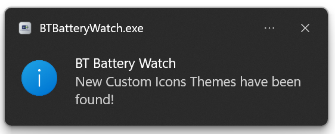
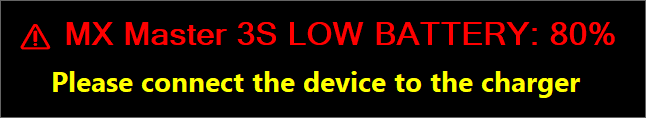
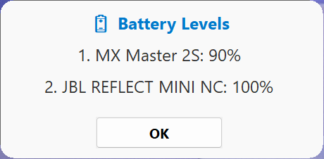
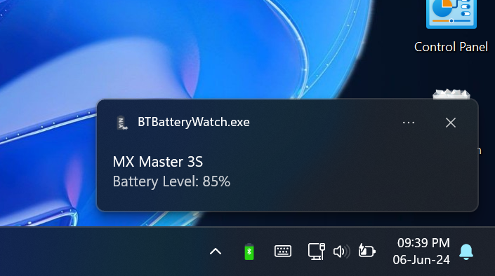
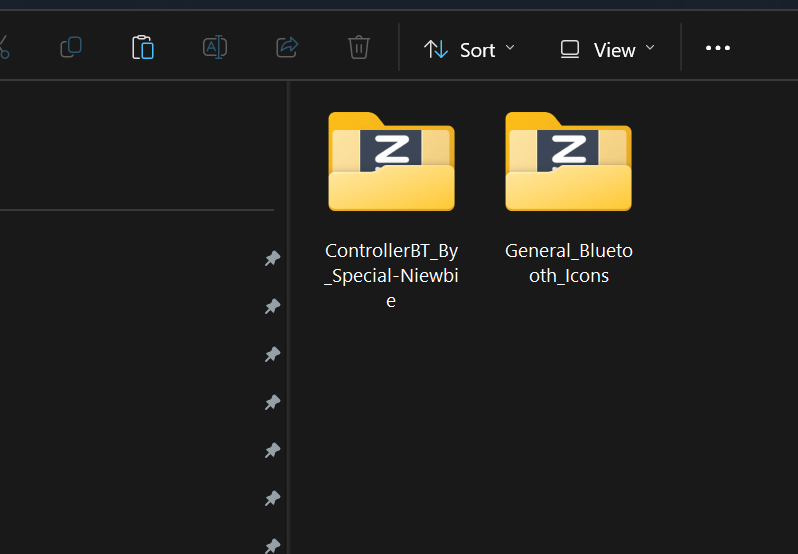
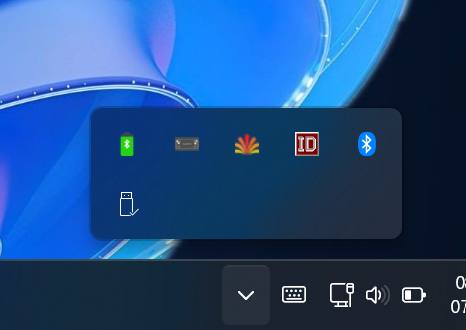
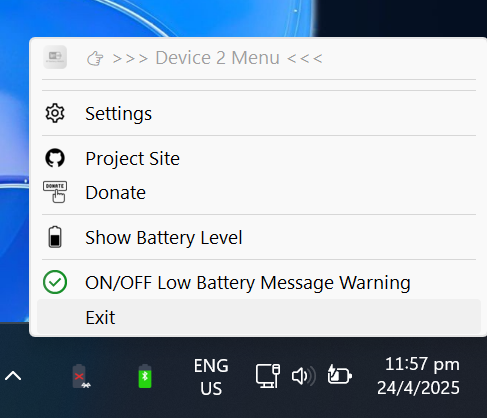
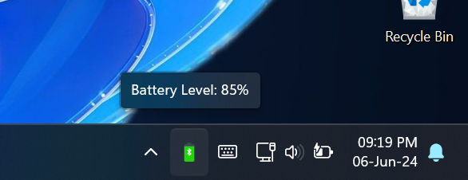
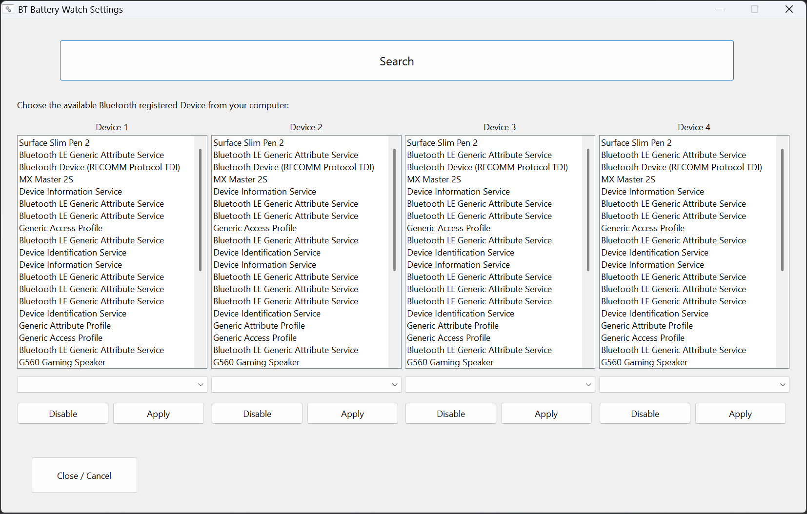

# BT Battery Watch

**BT Battery Watch** is a lightweight program for monitoring the battery level of Bluetooth devices on your Windows computer. The program does not rely on third-party software or drivers, runs in the background, and displays the battery level of the Bluetooth device every 30 minutes. I created **BT Battery Watch** because I have several wireless mice, and the official software from mouse manufacturers has become intrusive and heavy with continuous background startup. I liked the idea of having a lightweight software that gives me the essential information: an overview of how much battery my mice have left before running out.

## 🙏 Thank You

First of all, thank you all for your interest in **BT Battery Watch**! I’ve read every piece of feedback and, starting with version **2.0.0**, I’ve evolved this little tool into something more complete—while preserving its original lightweight nature. It now has its own identity, with a well-defined icon and a handful of powerful new features.

---

## 🚀 What’s New

- **Multi-device support**: Track up to **4** Bluetooth devices simultaneously.  
  *(Windows must expose the device’s battery level by default under “Bluetooth & devices.”)*  
- **Custom-icon sharing**: Drop and Upload here your own icon-packs into the `Custom_Icons/` folder and BT Battery Watch will detect them automatically. You can even contribute your packs via Git—just request a push! The message will come out from windows as below:
  
- **Revamped system-tray menu**: A brand-new, organized menu structure with clear labels and icons.  

---

## 🔋 Main Features

1. **4-device monitoring Battery level**  

   - Add up to four devices in `conf.exe`.  
   - Each device must be paired via Bluetooth (not via a USB receiver).  

2. **Screen Warning Message for the device that it's going below 20%** 

   *here the picture as reference*:
   

3. **Dynamic tray icon**  

   - Icon updates every 10 minutes to reflect current battery level.  

4. **Hover tooltip**  

   - See “Device Name: XX%” when you hover over the tray icon.  

5. **On-demand pop-up**  

   - Press **WIN + SPACE** to show a disappearing notification with name and battery level. On Main Software will come out like that, to watch all the connected devices:
      

   - On all the restDevice 2, 3 and 4 will pop-up like that if pressed on System Tray icon:

     

     

6. **Easy access settings**  

   - Open “Settings” from the tray menu to change devices, update frequency, etc.  

7. **Auto-update checks**  
   - Notifies you when a new version is available and now download directly the exe installation (instead of to go manually to the site).  

---

## 📁 Custom Icons Online Folder

You can share and use custom icon-packs:

1. Clone or download the `Custom_Icons/` folder from the project site.  
2. Create your own subfolder, e.g. "Custom_Icons/ControllerPS5_by_SteveJobs/""
- **Use underscores** (`_`) instead of spaces in folder names.  
3. Export your icons as a **single** `.ico` file (multi-icon, auto-scale) at **256×256** resolution if possible.  
4. Name each file *.ico* exactly:  
**BT1, BT3, BT5, BT10, BT15, BT20, BT25, BT30, BT35, BT40, BT45, BT50, BT55, BT60, BT65, BT70, BT75, BT80, BT85, BT90, BT95, BT100**

5. **Do not** include `BTdisco.ico` (the “disconnected” icon)—that one is built in.  

Once your pack is in place, choose it from the “New Custom Icons” menu in the System Tray.

---

## 📋 Icon-Naming Guidelines

| File name | Battery level |  
|-----------|---------------|  
| `BT1.ico` | 1 %           |  
| `BT3.ico` | 3 %           |  
| …         | …             |  
| `BT100.ico` | 100 %       |  

- All files must use the `.ico` extension.  
- Resolution: **256 × 256** (multi-icon, auto-scale).  
- Folder names must use underscores (`_`) instead of spaces example `PS5_Icons_by_SteveJobs`. Somenting like this:
    

---

## 🖱️ System-Tray Menu (Master Menu)

Below is the new menu structure for **Device 1** (the “master” monitor). Each entry appears under the tray icon.

| Menu label                        | Description                                                      |
|-----------------------------------|------------------------------------------------------------------|
| **👉 >>> BT Battery Watch Menu <<<** | Title label for the main app                         |
| ----------------------------------- |                                                                  |
| **New Custom Icons**              | Opens the folder to add or update custom-icon packs               |
| ----------------------------------- |                                                                  |
| **Settings**                      | Opens the configuration window (`conf.exe`)                      |
| ----------------------------------- |                                                                  |
| **Reload**                        | Reloads the AHK script (applies any changes immediately)         |
| ----------------------------------- |                                                                  |
| **Project Site**                  | Opens the GitHub releases page                                   |
| **Donate**                        | Opens the donation page (PayPal)                           |
| **Show Version**                  | Displays current version number and changelog snippet            |
| **Show All Battery Levels**       | Pops up a window listing all 4 devices and their current levels  |
| ----------------------------------- |                                                                  |
| **ON / OFF Battery Monitor ShortKeys** | WIN + SPACE hotkey to turn it on or off                  |
| **ON / OFF Low Battery Warning**  | Enables or disables low-battery notifications in the middle of the screen when we are below of 20% of battery |
| **Exit**                          | Closes the application                                           |

---

## 📱 Device 2–4 Menus (Secondary “Incubators”)

For devices 2, 3 and 4, the menu is similar but streamlined. Replace `%deviceName%` with the actual device friendly name.

| Menu label                      | Description                                             |
|---------------------------------|---------------------------------------------------------|
| **👉 >>> Device 2 to 4 Menu <<<** | Title label from the second to fourth device |
| ----------------------------------- |                                                         |
| **Settings**                    | Open the configuration window (`conf.exe`)              |
| ----------------------------------- |                                                         |
| **Project Site**                | Opens the GitHub releases page                          |
| **Donate**                      | Opens the donation page (PayPal)                  |
| ----------------------------------- |                                                         |
| **Show Battery Level**          | Display current battery level for this device with popup message |
| ----------------------------------- |                                                         |
| **ON / OFF Low Battery Warning**| Enables or disables low-battery notifications in the middle of the screen when we are below of 20% of battery |
| **Exit**                        | Close the application                                   |

---

## 
**Reference Pictures**:

1.

2.
 

3.

4.

## How to use:
1. **Initial configuration**: You need to open the System Tray Menu on the Icon and select **Settings**. In this window, you have a `Search` button to press, and the software will search for all Bluetooth devices directly already registered/connected to the system and list them in the appropriate section. Simply select the name of your Bluetooth device that you want to monitor the battery, select the Icons Pack and press the `Apply` button. Once the `Apply` button is pressed, you can close the window.
2. **Bluetooth battery monitoring**: Once configured, the program will start automatically and monitor the battery level of the specified Bluetooth device in the configuration file. Visual notifications will be displayed in the System Tray.
3. **Settings and updates**: If you want to change the device/mouse/ hearphones/Keyboards to monitor, you can easily access the program settings via the menu in the System Tray. Additionally, the program automatically checks for available updates and notifies you when a new version is available you can directly download the exe installer without connecting to the project page.

## Installation and use:
1. Download the latest version of the program from the [GitHub repository](https://github.com/Special-Niewbie/BTBatteryWatch/releases).
2. Run the installer that I have prepared.
3. Follow the instructions for the initial configuration.
4. The program will automatically start monitoring the battery level of the specified Bluetooth device once you set it.

## Important Note
BT Battery Watch, being a very lightweight program and not relying on third-party libraries or software, can detect the battery percentage of your device if the Windows operating system sees the battery level of your device by default in the Bluetooth & devices Settings section, wich means usually must be directly by Bluetooth the device without middle receiver.

## Donation
If you enjoy using this software and find it helpful and you have the possibility, please consider making a small donation to support the ongoing development of this and other projects. Your generosity is greatly appreciated!
PayPal:

Ko-fi:

