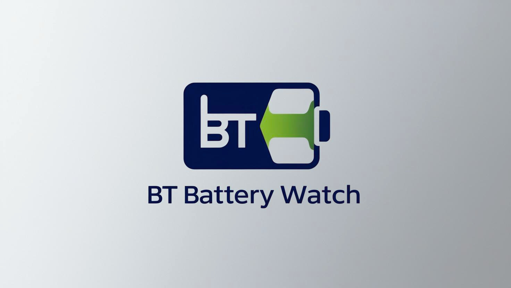
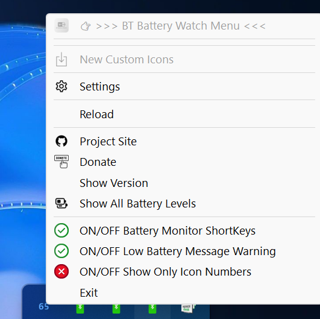

# BT Battery Watch

**BT Battery Watch** is a lightweight program for monitoring the battery level of Bluetooth devices on your Windows computer.  It does not rely on third-party software or drivers, runs silently in the background, and updates the battery level every 10 minutes.  
Originally designed to replace bloated software from mouse manufacturers, BT Battery Watch focuses on being lightweight and effective.

---

## 🙏 Thank You

Thank you all for your incredible support and feedback!  
Starting from version **2.0.0**, BT Battery Watch has evolved with new powerful features—while remaining true to its lightweight roots.  
We now have a full identity with a dedicated icon and more customizations.

---

## 🚀 What’s New

- **Multi-device support**: Monitor up to **4 Bluetooth devices** at the same time.  

- **Custom Icon Packs**:  
  You can now **upload and share** your own custom icon sets!  
  Simply upload your icon pack into the `Custom_Icons/` folder in the GitHub Project, and BT Battery Watch will automatically detect when a new pack is available online for download.  
  If you prefer to keep your pack private, you can manually add your icon folder into `C:\Users\(Your USER Name)\AppData\Local\BTBatteryWatch\icons`.  
  The program will then include your new Icon Pack in the selection menu inside `conf.exe`.
  
  Example notification when a new Custom Icon Pack is available online from the GitHub Project:
  
  
  
- **Revamped System Tray Menu**:  
  Organized, clean, and packed with quick-access features.

- **New Menu Option**:  
  `ON/OFF Show Only Icon Numbers` — Switch to a dynamic "Number-only" icon style created automatically by the program.  
  Instead of battery icons, you will see dynamic colored numbers as icons, representing the battery percentage directly.

  Example of the new "Number-only" icons:
  
  

---

## 🔋 Main Features

1. **Battery Level Monitoring**  
   - Monitor up to **4 devices**.
   - Devices must be Bluetooth-paired (no USB receivers).

2. **Low Battery Warning**  
   - Visual notification when any device drops below **20%**.
   - Example:
     

3. **Dynamic System Tray Icons**  
   - Automatically updates the tray icon to reflect the current battery percentage every 10 minutes.

4. **Hover Tooltips**  
   - Displays "Device Name: XX%" when hovering over a tray icon.

5. **Quick Pop-up Notifications**  
   - Press **WIN + SPACE** to instantly show battery levels of all devices.

   Example:
   
   
   Devices 2-4 have their own quick pop-up too:
   

6. **Simple Settings Access**  
   - Quickly open the settings window (`conf.exe`) from the tray menu.

7. **Auto-Update System**  
   - The program checks for new versions automatically and allows direct download of the installer.

---

## 📁 Custom Icons and GitHub Community Sharing

You can now create, upload, and share your **Custom Icon Packs**!

**How it works:**
1. Inside the project, you will find a `Custom_Icons/` folder.  
2. Create a new subfolder for your icons (example: `Custom_Icons/ControllerPS5_by_SteveJobs/`).  
   - **Use underscores** (`_`) instead of spaces in the folder names.
3. Export your icons as a **single multi-icon `.ico` file** (recommended resolution: **256×256**, scalable).
4. Follow the naming convention exactly:
   - **BT1, BT3, BT5, BT10, BT15, BT20, BT25, BT30, BT35, BT40, BT45, BT50, BT55, BT60, BT65, BT70, BT75, BT80, BT85, BT90, BT95, BT100.ico**.
5. **Do not include** the disconnected icon (`BTdisco.ico`) — it's built into the program.

When new Icon Packs are uploaded by the community on GitHub, the program **notifies you automatically**, inviting you to download them without needing to manually search!

Folder structure example:

---

## 📋 Icon Naming Guidelines

| File name  | Battery Level |
|------------|---------------|
| `BT1.ico`  | 1%            |
| `BT3.ico`  | 3%            |
| ...        | ...           |
| `BT100.ico`| 100%          |

- All icons must use `.ico` extension.
- Suggested resolution: **256×256** (multi-icon for scaling).
- Folder names: Use underscores `_` instead of spaces.

---

## 🖱️ System Tray Menus

### ➤ Master Menu (Device 1)

| Menu Label                         | Description                                                              |
|-------------------------------------|--------------------------------------------------------------------------|
| 👉 >>> BT Battery Watch Menu <<<    | Title label for the main app                                             |
| New Custom Icons                    | Opens the `Custom_Icons/` folder to add or update Icon Packs             |
| Settings                            | Opens the configuration window (`conf.exe`)                              |
| Reload                              | Reloads the program and applies new changes immediately                  |
| Project Site                        | Opens the GitHub project page                                            |
| Donate                              | Opens the donation page (PayPal, Ko-fi)                                  |
| Show Version                        | Displays current program version and changelog                         |
| Show All Battery Levels             | Shows a pop-up with all connected device battery levels                  |
| **ON/OFF Battery Monitor ShortKeys**| Enable or disable the **WIN + SPACE** shortcut                           |
| **ON/OFF Low Battery Warning**      | Enable or disable screen notifications below 20% battery                |
| **ON/OFF Show Only Icon Numbers**   | Switch to Number-only icons for dynamic battery level representation     |
| Exit                                | Close the application                                                   |

---

### ➤ Secondary Devices Menus (Devices 2–4)

| Menu Label                         | Description                                                              |
|-------------------------------------|--------------------------------------------------------------------------|
| 👉 >>> Device 2 to 4 Menu <<<       | Title label for the additional devices                                   |
| Settings                            | Opens the configuration window (`conf.exe`)                              |
| Project Site                        | Opens the GitHub project page                                            |
| Donate                              | Opens the donation page (PayPal, Ko-fi)                                  |
| **Show Battery Level**              | Shows a pop-up with current battery level for this device                |
| **ON/OFF Low Battery Warning**      | Enable or disable screen notifications below 20% battery                |
| **ON/OFF Show Only Icon Numbers**   | Switch to Number-only icons for dynamic battery level representation     |
| Exit                                | Close the application                                                   |

---

## 📷 Reference Pictures

1. 
2.  
3. 
4. 

---

## 🔧 How to Use

1. **Initial Setup**  
   - Open the tray icon menu and select **Settings**.  
   - Press the **Search** button to find all paired Bluetooth devices.  
   - Choose your device, select an Icon Pack, and press **Apply**.

2. **Battery Monitoring**  
   - After setup, the program will monitor the device's battery percentage in the System Tray.  
   - Notifications and icon updates will occur automatically.

3. **Settings and Updates**  
   - Easily change your devices and settings at any time from the tray menu.  
   - Automatic update checks keep you up-to-date without manual intervention.

---

## 📦 Installation

1. Download the latest release from the [GitHub repository](https://github.com/Special-Niewbie/BTBatteryWatch/releases).
2. Run the installer.
3. Follow the initial setup instructions.
4. Enjoy battery monitoring for your Bluetooth devices!

---

## ⚡ Important Notes

BT Battery Watch detects battery levels only if Windows natively shows the Bluetooth device's battery percentage (e.g., in **Bluetooth & devices** settings).  
This typically requires direct Bluetooth pairing — **not via a USB receiver**.

---

## Donation
If you enjoy using this software and find it helpful and you have the possibility, please consider making a small donation to support the ongoing development of this and other projects. Your generosity is greatly appreciated!
PayPal:

Ko-fi:

